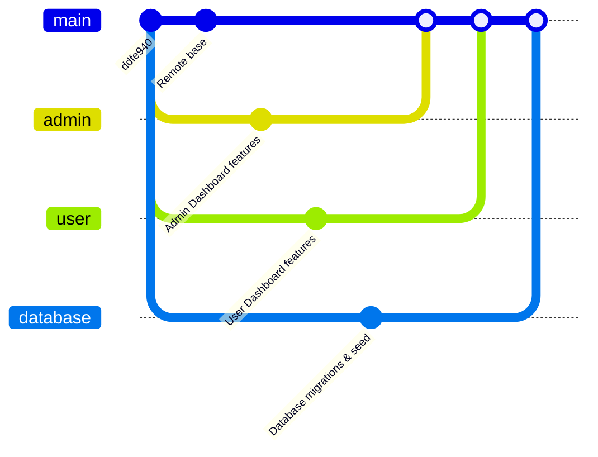

# Cafe Website Team Collaboration & Git Guide

Welcome to the team collaboration guide! This document explains our Git branching strategy, repository configuration, environment setup, and the exact daily workflow for each developer to collaborate smoothly without any code loss or synchronization issues.

---

## 1. Branching Strategy

To keep the codebase stable and track developments cleanly, we use a **Feature Branching Strategy** based on three dedicated branches and one integration branch:



* **`main`**: The stable integration branch. No developer should commit directly to `main`. It is updated only via Pull Requests (PRs) from feature branches.
* **`admin`** (Developer 1 - Pavithra): Dedicated branch for Admin Dashboard development.
* **`user`** (Developer 2 - Nikhil): Dedicated branch for User Dashboard, bookings, reviews, and client-facing pages.
* **`database`** (Developer 3 - Vineela): Dedicated branch for Database schemas, migrations, seeds, Sentry integration, and logger utilities.

---

## 2. Safe Onboarding Guide (First-Time Setup)

Since everyone has been committing locally and repositories have diverged, follow these steps to **preserve your work** and align with the remote repository.

### Developer 3 (Vineela)
> [!NOTE]
> **Completed:** Developer 3's workspace is already fully configured. Her database changes are on the `database` branch, her admin optimization changes are on the `admin` branch, and the local `main` is clean.

### Developer 1 (Pavithra - Admin Dashboard)
Follow these commands in your terminal to back up your current workspace and switch to the `admin` branch:
1. **Back up your current workspace**:
   ```bash
   git add .
   git commit -m "backup: pavithra local changes"
   git branch backup-admin-workspace
   ```
2. **Align your local `main` branch**:
   ```bash
   git checkout main
   git fetch origin
   git reset --hard origin/main
   ```
3. **Switch to the remote `admin` branch**:
   ```bash
   git checkout admin
   git pull origin admin
   ```
4. **Restore your specific admin files from your backup branch**:
   ```bash
   git checkout backup-admin-workspace -- src/app/admin/ src/app/api/admin/
   ```
5. **Commit and push your changes**:
   ```bash
   git add .
   git commit -m "feat: restore admin dashboard changes"
   git push origin admin
   ```

### Developer 2 (Nikhil - User Dashboard)
Follow these commands in your terminal to back up your current workspace and switch to the `user` branch:
1. **Back up your current workspace**:
   ```bash
   git add .
   git commit -m "backup: nikhil local changes"
   git branch backup-user-workspace
   ```
2. **Align your local `main` branch**:
   ```bash
   git checkout main
   git fetch origin
   git reset --hard origin/main
   ```
3. **Switch to the remote `user` branch**:
   ```bash
   git checkout user
   git pull origin user
   ```
4. **Restore your specific user files from your backup branch**:
   ```bash
   git checkout backup-user-workspace -- src/app/profile/ src/app/cart/ src/app/my-bookings/ src/app/table-booking/ src/app/event-booking/
   ```
5. **Commit and push your changes**:
   ```bash
   git add .
   git commit -m "feat: restore user dashboard changes"
   git push origin user
   ```

---

## 3. Daily Developer Workflow

Follow this cycle every single day to stay in sync and avoid merge conflicts.

### Step 1: Before Coding (Get the Latest Code)
Always pull updates before you write any new lines of code:
```bash
git checkout main
git pull origin main
git checkout <your-branch-name>  # e.g., admin, user, or database
git merge main
```
*Resolve conflicts if any occur, then run your local project to confirm it builds.*

### Step 2: During Development
Make frequent, small commits. Group changes logically:
```bash
git add <specific-modified-files>
git commit -m "feat/fix: descriptive commit message"
```

### Step 3: After Coding (Publish Your Work)
Push your branch to GitHub so others can see your work and it is backed up in the cloud:
```bash
git push origin <your-branch-name>
```

### Step 4: Before Merging Into Main (Integrating Features)
When a feature is finished and ready to merge into `main`:
1. **Sync with the latest `main`**:
   ```bash
   git checkout main
   git pull origin main
   git checkout <your-branch-name>
   git merge main
   ```
2. **Resolve any conflicts locally** (see Section 6 below).
3. **Push the resolved branch**:
   ```bash
   git push origin <your-branch-name>
   ```
4. **Create a Pull Request (PR)** on GitHub from `<your-branch-name>` to `main`.
5. Have another team member review and merge the PR.

---

## 4. File-specific Commit Rules

| File / Folder | Should Commit? | Reason |
| :--- | :---: | :--- |
| **`package-lock.json`** | **YES** | Locks dependency tree versions. Essential to prevent "works on my machine" issues with npm packages. |
| **`prisma/migrations/`** | **YES** | Tracks PostgreSQL schema evolution. Crucial for keeping local, Docker, and staging databases in sync. |
| **`.env` / `.env.local`** | **NO** | Contains sensitive credentials (passwords, JWT keys). Covered by `.gitignore`. |
| **`.env.example`** | **YES** | Template file. Used to document which environment variables the app needs without exposing keys. |
| **`node_modules/`** | **NO** | Generated folder. Re-downloaded via `npm install`. |
| **`.next/` / `build/` / `dist/`** | **NO** | Compiled application output. Generated during build. |
| **`*.log`** | **NO** | Server and tool debug output. |

---

## 5. Technology Stack Synchronization

To ensure Next.js, Docker, and Prisma stay aligned across all developers:

### 1. Database & Migrations (Prisma + Docker)
* When a developer changes `prisma/schema.prisma`:
  1. Generate a migration: `npm run db:migrate` (runs `prisma migrate dev`).
  2. Commit both `schema.prisma` and the new migration folder inside `prisma/migrations/`.
* When you pull database schema changes:
  1. Spin up your local database: `npm run docker:up`.
  2. Apply migrations to your local db: `npm run db:migrate`.
  3. Generate client: `npm run db:generate`.

### 2. Dependency Updates (`package.json` + `package-lock.json`)
* When someone updates dependencies (e.g. adding `pino` or `@sentry/nextjs`):
  1. They push updated `package.json` and `package-lock.json`.
  2. After pulling, other developers **must run**:
     ```bash
     npm install
     ```
     to install the newly added packages.

---

## 6. Resolving Merge Conflicts Safely

Merge conflicts occur when two developers modify the same line in a file. Git will stop the merge and label the conflicts:

```typescript
<<<<<<< HEAD
// Your local changes
const port = process.env.PORT || 3000;
=======
// Remote changes from main
const port = 3000;
>>>>>>> main
```

### Steps to Resolve:
1. Open the conflicting file in your IDE (VS Code / Antigravity).
2. Choose to keep **Accept Current Change** (your work), **Accept Incoming Change** (main branch work), or edit manually to combine both.
3. Remove the conflict markers (`<<<<<<<`, `=======`, `>>>>>>>`).
4. Stage the resolved files:
   ```bash
   git add <resolved-file-path>
   ```
5. Complete the merge commit:
   ```bash
   git commit -m "merge: resolve conflicts with main"
   ```
6. Push to your branch:
   ```bash
   git push origin <your-branch-name>
   ```

---

## 7. Troubleshooting & Verification Commands

Use these commands to verify the state of your workspace:

* **Prisma schema validation**:
  ```bash
  npx prisma validate
  ```
* **Verify Next.js build**:
  ```bash
  npm run build
  ```
* **Check local branches**:
  ```bash
  git branch -a
  ```
* **Check commit log**:
  ```bash
  git log --oneline -n 10
  ```
